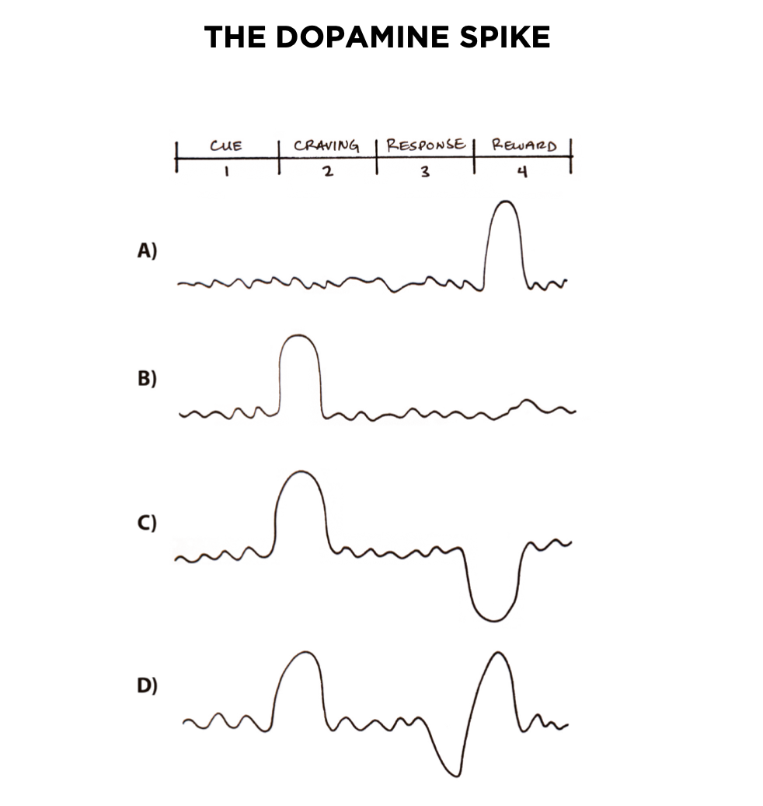

# Atomic Habits

Kebiasaan-kebiasaan kecil yang akan memberikan hasil luar biasa.

---

Penulis: James Clear

Status: Sedang dibaca

---

**Atomic Habit** adalah praktik teratur atau rutin yang tidak hanya kecil dan mudah dilaksanakan, tapi juga sumber atau komponen dari sistem yang lebih besar dengan bunga majemuk.

## Bagaimana kebiasaan kecil akhirnya akan menghasilkan perbedaan besar?

Bayangkan jika kita bisa menjadi **1% lebih baik setiap hari** dalam setahun, akhirnya kita akan 37 kali lebih baik pada penghujung tahun. Sebaliknya, jika kita **1% lebih buruk** setiap harinya, di penghujung tahun kita akan mengalami kemunduran hampir menjadi 0.

Sukses adalah produk kebiasaan sehari-hari, bukan sesuatu yang didapatkan secara tiba-tiba (instan) sekali seumur hidup.

## Berfokus pada Sistem

Berfokuslah pada sistem, proses yang mengantar kepada sasaran/hasil-hasil yang ingin kita raih.

Jika hanya berfokus pada sasaran tanpa menyediakan waktu yang cukup untuk merancang sistem, sejumlah masalah akan timbul:

- Masalah 1: pemenang dan pecundang memiliki sasaran yang sama
- Masalah 2: meraih sasaran hanya perubahan sesaat
- Masalah 3: sasaran membatasi kebahagian
- Masalah 4: sasaran tidak bersesuaian dengan kemajuan jangka panjang

## Kebiasaan Berbasis Identitas Diri

Ada 3 lapisan tempat perubahan dapat terjadi.

- Lapisan pertama: mengubah hasil

  Terkait dengan mengubah hasil: menurunkan berat badan, menerbitkan buku, memenangkan kejuaraan.

* Lapisan kedua: mengubah proses

  Terkait dengan mengubah kebiasaan dan sistem: menerapkan rutinitas baru, merapikan meja kerja, latihan meditasi.

- Lapisan ketiga: mengubah identitas

  Terkait dengan mengubah keyakinan: citra diri, penilaian terhadap diri sendiri dan orang lain, pandangan tentang dunia. Sebagian besar keyakinan, asumsi, dan kecenderungan yang kita pegang terkait dengan lapisan ini.

> Hasil adalah hal-hal yang kita dapatkan. Proses terkait dengan apa yang kita lakukan. Identitas terkait dengan apa yang kita yakini.

Dengan membangun **kebiasaan berbasis identitas**, kita berfokus pada kita ingin menjadi _sosok_ seperti apa. Perubahan perilaku sejati adalah perubahan identitas. Perbaikan hanya akan bertahan sementara, kecuali menjadi bagian dari identitas siapa diri Anda.

### Dua Langkah untuk Mengubah Identitas

1. **Putuskan tipe orang seperti apa yang kita cita-citakan**

   Bisa dimulai dengan merunut kebelakang dari hasil-hasil yang kita inginkan ke tipe orang seperti apa yang bisa mendapatkan hasil-hasil tersebut.

2. **Buktikan pada diri sendiri dengan kemenangan-kemenangan kecil**

   Setelah tau tipe orang seperti apa yang kita cita-citakan, kita bisa mulai mengambil langkah-langkah kecil untuk memperkuat identitas yang dikehendaki. Semakin sering suatu perilaku diulang, akan memperkuat identitas yang terkait dengan perilaku itu.

> Cara paling praktis untuk mengubah _siapa_ kita adalah dengan mengubah _apa_ yang kita lakukan.

## Cara Kerja Kebiasaan

Kebiasaan adalah perilaku yang telah diulang cukup sering sampai menjadi otomatis.

Otak menciptakan kebiasaan untuk mengurangi beban kognitif dan membebaskan kapasitas mental sehingga kita dapat mengalokasikan perhatian pada tugas-tugas lain.

Proses membangun kebiasaan dapat dibagi ke dalam 4 langkah:

1. **Mendapatkan Petunjuk (Cue)**

   Petunjuk memicu otak untuk memulai perilaku. Ini informasi kecil yang meramalkan imbalan.

2. **Menumbuhkan Gairah (Craving)**

   Gairah atau nafsu menjadi motivasi, kekutan penggerak di balik setiap kebiasaan.

3. **Menanggapi (Response)**

   Tanggapan adalah kebiasaan yang kita lakukan.

4. **Menikmati Hasil (Reward)**

   Akhirnya tanggapan akan menghasilkan imbalan, ganjaran yang merupakan sasaran akhir setiap kebiasaan.

> Lingkaran kebiasaan: petunjuk memicu gairah, yang memotivasi tanggapan, yang mengantar ke ganjaran yang akan memuaskan gairah, dan akhirnya akan terkait lagi dengan petunjuk.

### Empat Kaidah Perubahan Perilaku

Aturan-aturan sederhana untuk menciptakan kebiasaan-kebiasaan baik dan membongkar kebiasaan-kebiasaan buruk:

|                          | Bagaimana menciptakan kebiasaan-kebiasaan baik | Bagaimana membongkar kebiasaan-kebiasaan buruk |
| ------------------------ | :--------------------------------------------: | :--------------------------------------------: |
| Hukum pertama (Petunjuk) |            Menjadikannya _terlihat_            |          Menjadikannya _tak terlihat_          |
| Hukum kedua (Gairah)     |            Menjadikannya _menarik_             |         Menjadikannya _tidak menarik_          |
| Hukum ketiga (Tanggapan) |             Menjadikannya _mudah_              |             Menjadikannya _sulit_              |
| Hukum keempat (Ganjaran) |           Menjadikannya _memuaskan_            |          Menjadikannya _mengecewakan_          |

## Kaidah Pertama: Menjadikan Terlihat

- **Kartu Skor Kebiasaan**

  Tantangan terbesar dalam mengubah suatu kebiasaan adalah **mempertahankan kesadaran** tentang apa yang sedang kita lakukan.

  Untuk lebih menyadari tentang perilaku kita, bisa dengan latihan sederhana yang disebut [Kartu Nilai Kebiasaan (Habits Scorecard)](https://jamesclear.com/atomic-habits/scorecard).

  Buat daftar lengkap kebiasaan sehari-hari kita, kemudian beri nilai, apakah itu kebiasaan baik (+), buruk (-), atau netral (=).

  Untuk menentukan nilai terhadaap suatu kebiasan, bisa dengan mengajukan pertanyaan "_Apakah perilaku ini membantu saya menjadi tipe orang yang saya inginkan? Apakah kebiasaan ini mendukung atau menolak identitas yang saya inginkan?_".

  | Daily Habits      | Positive (+), Negative (-), or Neutral (=) |
  | ----------------- | :----------------------------------------: |
  | Bangun tidur      |                     +                      |
  | Sholat subuh      |                     +                      |
  | Menyiram tanaman  |                     +                      |
  | Baca buku         |                     +                      |
  | Cek twitter       |                     -                      |
  | Mandi             |                     =                      |
  | Mulai kerja       |                     +                      |
  | dan seterusnya... |                    ...                     |

- **Niat Implementasi**

  Petunjuk paling jelas untuk memulai suatu perilaku/kebiasaan adalah _waktu_ dan _tempat_.

  Orang yang membuat rencana spesifik _kapan_ dan _dimana_ mereka akan melakukan kebiasaan baru lebih mungkin terus melakukannya.

  Rumusnya: **_Aku akan [PERILAKU] pada [WAKTU] di [LOKASI]_**

  Contoh:

  - Aku akan _membaca buku selama 1 jam_ pada _pukul 6 pagi_ di _kamar_.
  - Aku akan _bersepeda selama 2 jam_ pada _hari minggu pukul 6 pagi_ menyusuri _jalanan kota_.
  - Aku akan _belajar web programming selama 3 jam_ pada _pukul 8 malam_ di _ruang belajar_.

- **Menumpuk Kebiasaan**

  Adalah bentuk khusus dari niat implementasi. Alih-alih menjadikan waktu dan tempat sebagai petunjuk, kita menggunakan suatu _kebiasaan sebagai petunjuk_ untuk memulai kebiasaan yang lain.

  Rumusnya: **_Setelah [KEBIASAAN SEKARANG], aku akan [KEBIASAAN BARU]_**

  Contoh:

  - Setelah _membuat secangkir kopi_, aku akan menikmatinya sambil _membaca buku selama 1 jam_.
  - Setelah _membaca buku_, aku akan _membuat rangkuman_ tentang yang barusan aku baca.
  - Setelah _berolah raga (push up ataupun bersepeda)_, aku akan langsung _mandi_.

- **Menciptakan Konteks dengan Lingkungan Sekitar**

  Kebiasaan juga dipengaruhi lingkungan/ruangan kita berada, karena di sana terletak petunjuk-petunjuk nyata yang dapat memicu kebiasaan.

  Untuk memulai kebiasaan baru, kita harus mengatur mengatur ulang lingkungan kita agar petunjuk-petunjuk untuk kebiasaan tersebut lebih terlihat jelas. Contohnya:

  - Jika ingin mengembangkan kebiasaan mambaca 1 jam sebelum tidur, letakkan buku di samping tempat tidur.
  - Jika ingin makan buah lebih banyak, letakkan buah dalam kerangjang di beberapa tempat di rumah, misal di ruang tamu dan di meja makan.
  - Jika ingin meminum air putih lebih banyak, siapkan sebotol air di meja kerja.

  Menciptakan konteks/hubungan dengan ruang-ruang di sekitar kita juga penting. Berpikirlah dalam konteks bagaimana kita berinteraksi dengan ruang-ruang di sekitar kita. Contoh:

  - Meja kerja adalah tempat Saya untuk fokus bekerja dan melakukan hal-hal produktif, bukan untuk menghabiskan waktu berselancar di internet (melihat sosial media, youtube, dsb)
  - Kursi di ruang tamu ini adalah tempat Saya membaca buku. Sedangkan di sofa Saya biasa bersantai sambil nonton tv.
  - Tempat tidur adalah tempat Saya beristirahat setelah beraktivitas seharian, tidak boleh ada aktivitas lain di sana (misal bermain HP).

  Dengan menciptakan ruang-ruang terpisah –– untuk bekerja, belajar, berolahraga, bersantai, dan lainnya –– kita membuat petunjuk untuk kebiasaan-kebiasaan yang berbeda tidak tercampur aduk. Sehingga kebiasaan-kebiasaan tersebut lebih mudah diciptakan dan dipertahankan.

## Kaidah Kedua: Menjadikan Menarik

Dopamin adalah salah satu zat kimia dalam tubuh yang mempengaruhi kebiasaan.

Dalam lingkaran kebiasaan, dopamin dilepaskan tidak hanya ketika menerima ganjaran, tapi juga ketika kita mengatisipasinya (saat membayangkan ganjaran ketika melihat suatu petunjuk / saat fase _craving_).

Dan setiap kali dopamin melonjak, begitu pula dengan tingkat motivasi untuk beraksi. Antisipasi terhadap ganjaranlah –– bukan pemenuhannya –– yang membuat kita melakukan tindakan.

Keterangan:
(A) Ketika kebiasaan pertama kali dipelajari
(B) Lonjakan dopamin terjadi setelah melihat petunjuk
(C) Lonjakan dopamin tetap terjadi setelah melihat petunjuk, walaupun ganjaran tidak didapatkan
(D) Lonjakan dopamin terjadi setelah melihat petunjuk, menurun karena ganjaran tidak datang secepat yang diharapkan, dan melonjak lagi setelah ganjaran didapatkan.

### Peran Keluarga dan Teman dalam Membentuk Kebiasaan

Kita tidak memiliki kebiasaan di babak awal hidup kita, **kita meniru**. Kita meniru dari ketiga kelompok berikut:

1. **Meniru orang yang akrab**

   Makin akrab kita dengan seseorang (teman, pasangan, ataupun keluarga), makin mungkin kita meniru beberapa kebiasaan mereka. Sehingga, untuk membangun kebiasaan yang lebih baik, beradalah di antara orang-orang yang memiliki kebiasaan yang baik pula.

2. **Meniru orang banyak**

   Setiap kali tidak yakin bagaimana harus bertindak, kita akan mencermati reaksi kelompok untuk memandu perilaku kita. Kita terus memantau lingkungan sekitar sambail bertanya-tanya, _"Apa yang dilakukan oleh semua orang lain?"_

3. **Meniru orang yang berkuasa / berpengaruh**

   Pada dasarnya, sebagai manusia, kita ingin berkuasa, dihormati, dipuji dan memiliki status. Oleh karenanya kita cenderung meniru perilaku-perilaku dari orang-orang yang telah memiliki kekuasaan, kehormatan, dipuji karna pencapaiannya, dan memiliki status istimewa/khusus di masyarakat.

   Kita meniru orang yang kita kagumi.

### Menemukan dan Mengoreksi Penyebab Kebiasaan

Penyebab suatu kebiasaan sebenarnya adalah prediksi yang mendahuluinya (prediksi tentang ganjaran yang akan didapatkan). Persaaan dan emosi mengubah _petunjuk_ yang kita dapatkan dan _prediksi_ yang kita buat menjadi suatu sinyal. Sinyal itu membantu kita menerangkan apa yang sedang kita rasakan.

Gairah adalah perasaan bahwa ada sesuatu yang hilang. Gairah adalah hasrat untuk mengubah keadaan internal.

Hasrat adalah perbedaan antara keadaan yang sekarang **sedang dialami** dengan keadaan yang **diinginkan**. Perbedaan inilah yang memberi alasan kita untuk beraksi, untuk mengubah keadaan saat ini menjadi yang diinginkan.

Kita dapat menjadikan kebiasaan sulit lebih menarik jika berhasil mengaitkan kebiasaan itu dengan pengalaman positif. Kita harus mengubah pola pikir. Lebih berfokus pada **_manfaat_** ketimbang kerugian akan membuat kebiasaan lebih menarik dan lebih mudah dijalankan.
