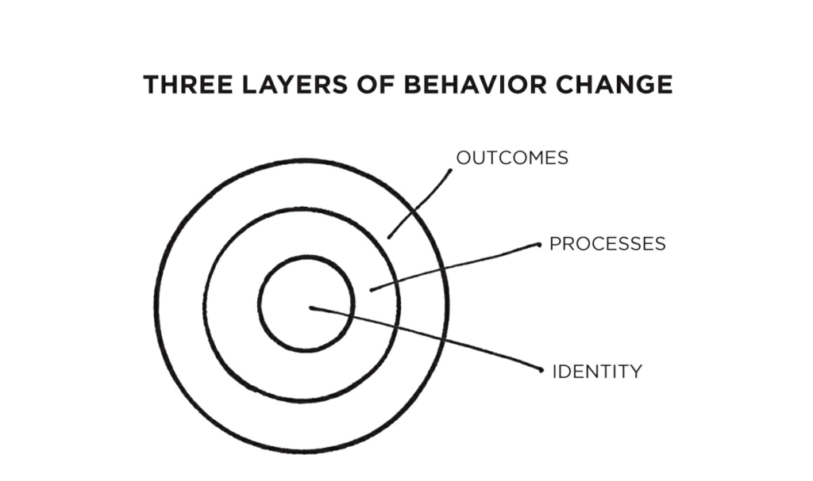

# Atomic Habits

Kebiasaan-kebiasaan kecil yang akan memberikan hasil luar biasa.

---

Penulis: James Clear

Status: Sedang dibaca

---

**Atomic Habit** adalah praktik teratur atau rutin yang tidak hanya kecil dan mudah dilaksanakan, tapi juga sumber atau komponen dari sistem yang lebih besar dengan bunga majemuk.

## Bagaimana kebiasaan kecil akhirnya akan menghasilkan perbedaan besar?

Bayangkan jika kita bisa menjadi **1% lebih baik setiap hari** dalam setahun, akhirnya kita akan 37 kali lebih baik pada penghujung tahun. Sebaliknya, jika kita **1% lebih buruk** setiap harinya, di penghujung tahun kita akan mengalami kemunduran hampir menjadi 0.

Sukses adalah produk kebiasaan sehari-hari, bukan sesuatu yang didapatkan secara tiba-tiba (instan) sekali seumur hidup.

## Berfokus pada Sistem

Berfokuslah pada sistem, proses yang mengantar kepada sasaran/hasil-hasil yang ingin kita raih.

Jika hanya berfokus pada sasaran tanpa menyediakan waktu yang cukup untuk merancang sistem, sejumlah masalah akan timbul:

- Masalah 1: pemenang dan pecundang memiliki sasaran yang sama
- Masalah 2: meraih sasaran hanya perubahan sesaat
- Masalah 3: sasaran membatasi kebahagian
- Masalah 4: sasaran tidak bersesuaian dengan kemajuan jangka panjang

## Kebiasaan Berbasis Identitas Diri

Ada 3 lapisan tempat perubahan dapat terjadi.

- Lapisan pertama: mengubah hasil

  Terkait dengan mengubah hasil: menurunkan berat badan, menerbitkan buku, memenangkan kejuaraan.

* Lapisan kedua: mengubah proses

  Terkait dengan mengubah kebiasaan dan sistem: menerapkan rutinitas baru, merapikan meja kerja, latihan meditasi.

- Lapisan ketiga: mengubah identitas

  Terkait dengan mengubah keyakinan: citra diri, penilaian terhadap diri sendiri dan orang lain, pandangan tentang dunia. Sebagian besar keyakinan, asumsi, dan kecenderungan yang kita pegang terkait dengan lapisan ini.

> Hasil adalah hal-hal yang kita dapatkan. Proses terkait dengan apa yang kita lakukan. Identitas terkait dengan apa yang kita yakini.

Dengan membangun **kebiasaan berbasis identitas**, kita berfokus pada kita ingin menjadi _sosok_ seperti apa. Perubahan perilaku sejati adalah perubahan identitas. Perbaikan hanya akan bertahan sementara, kecuali menjadi bagian dari identitas siapa diri Anda.

### Dua Langkah untuk Mengubah Identitas

1. **Putuskan tipe orang seperti apa yang kita cita-citakan**

   Bisa dimulai dengan merunut kebelakang dari hasil-hasil yang kita inginkan ke tipe orang seperti apa yang bisa mendapatkan hasil-hasil tersebut.

2. **Buktikan pada diri sendiri dengan kemenangan-kemenangan kecil**

   Setelah tau tipe orang seperti apa yang kita cita-citakan, kita bisa mulai mengambil langkah-langkah kecil untuk memperkuat identitas yang dikehendaki. Semakin sering suatu perilaku diulang, akan memperkuat identitas yang terkait dengan perilaku itu.

> Cara paling praktis untuk mengubah _siapa_ kita adalah dengan mengubah _apa_ yang kita lakukan.

## Cara Kerja Kebiasaan

Kebiasaan adalah perilaku yang telah diulang cukup sering sampai menjadi otomatis.

Otak menciptakan kebiasaan untuk mengurangi beban kognitif dan membebaskan kapasitas mental sehingga kita dapat mengalokasikan perhatian pada tugas-tugas lain.

Proses membangun kebiasaan dapat dibagi ke dalam 4 langkah:

1. **Mendapatkan Petunjuk (Cue)**

   Petunjuk memicu otak untuk memulai perilaku. Ini informasi kecil yang meramalkan imbalan.

2. **Menumbuhkan Gairah (Craving)**

   Gairah atau nafsu menjadi motivasi, kekutan penggerak di balik setiap kebiasaan.

3. **Menanggapi (Response)**

   Tanggapan adalah kebiasaan yang kita lakukan.

4. **Menikmati Hasil (Reward)**

   Akhirnya tanggapan akan menghasilkan imbalan, ganjaran yang merupakan sasaran akhir setiap kebiasaan.

> Lingkaran kebiasaan: petunjuk memicu gairah, yang memotivasi tanggapan, yang mengantar ke ganjaran yang akan memuaskan gairah, dan akhirnya akan terkait lagi dengan petunjuk.

### Empat Kaidah Perubahan Perilaku

Aturan-aturan sederhana untuk menciptakan kebiasaan-kebiasaan baik dan membongkar kebiasaan-kebiasaan buruk:

|                          | Bagaimana menciptakan kebiasaan-kebiasaan baik | Bagaimana membongkar kebiasaan-kebiasaan buruk |
| ------------------------ | :--------------------------------------------: | :--------------------------------------------: |
| Hukum pertama (Petunjuk) |            Menjadikannya _terlihat_            |          Menjadikannya _tak terlihat_          |
| Hukum kedua (Gairah)     |            Menjadikannya _menarik_             |         Menjadikannya _tidak menarik_          |
| Hukum ketiga (Tanggapan) |             Menjadikannya _mudah_              |             Menjadikannya _sulit_              |
| Hukum keempat (Ganjaran) |           Menjadikannya _memuaskan_            |          Menjadikannya _mengecewakan_          |
